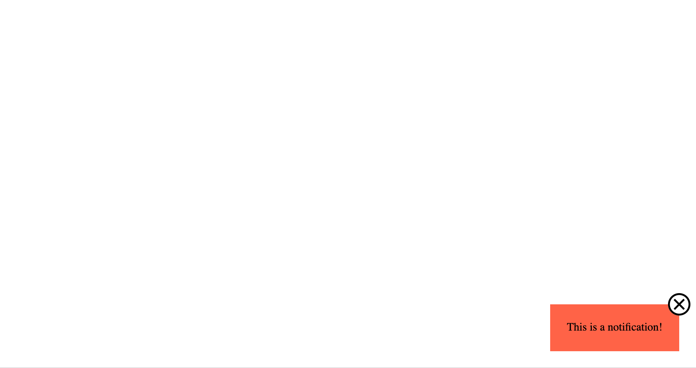

# Notification Popup

Use the provided HTML document to create the small notification popup shown in the reference image below -

### Instructions

- Don't change anything from the HTML code, just use the same classes or selectors to create your CSS stylesheet
- No matter how big the browser window is, the notification should always appear in the bottom right corner
- The X icon must appear with a size of 32x32px
- You will need to override the default style of the `<button>` element so that the icon appears as it should
- Try to make it as pixel-perfect as possible
