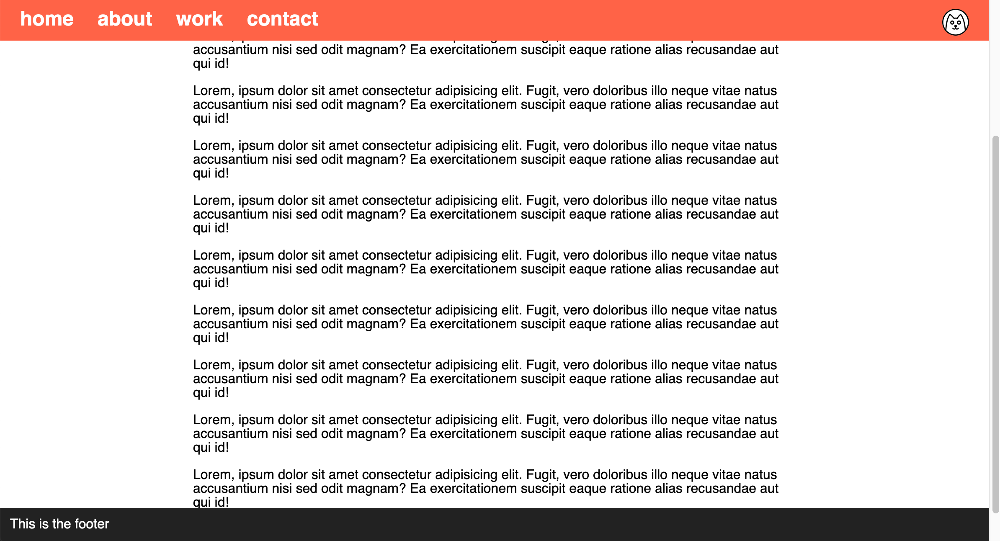

# Navigation and Footer

Create the webpage shown in the reference images below -

### Instructions 

- The page should have enough content for a vertical scrollbar to appear
- Add a navigation bar on top
- Place the cat icon on the right side of the navigation bar
- Add a footer
- Both the navigation and footer must always be visible
