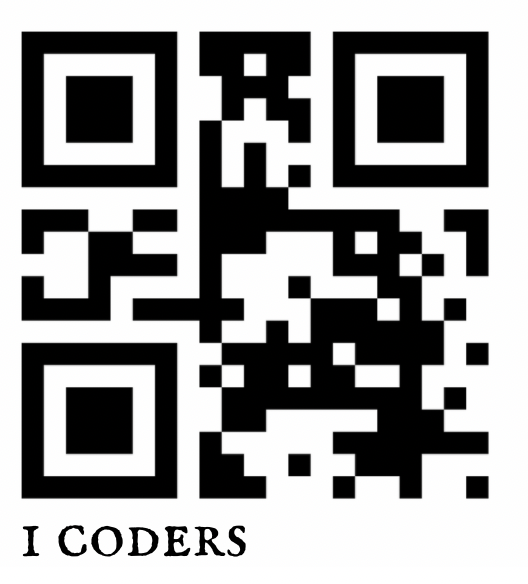

<!-- @fellow iCoders: I added the logo only in the context of an assignment. It is temporary/only suggested :) -->

#   iCoders - Class Book  

## Participants

|name|GitHub|role|
|:---|:---|:---|
|Carlo|[@carlotrimarchi](https://github.com/carlotrimarchi)|teacher|
|Helon|[@HelonDCI](https://github.com/HelonDCI)|teacher|
|Ahmad|[@atherahmad](https://github.com/atherahmad)|assistant|
|Aseel|[@aseelalmutareb](https://github.com/aseelalmutareb)|student|
|Kakai|[@justkakai](https://github.com/justkakai)|student|
|Fabio|[@fabio](https://github.com/fbphc)|student|
|Adrian|[@Adrian](https://github.com/AdrianGAD)|student|
|Isra|[@Isra](https://github.com/isragh)|student|
|Yannick|[@YannWe](https://github.com/YannWe)|student|
|Francis|[@loerk](https://github.com/loerk)|student|
|Mehmet|[@akayami001](https://github.com/akayami001)|student|
|William|[@william8421](https://github.com/William8421)|student|
|Regina|[@Reggie899](https://github.com/Reggie899)|student|
|Nila|[@nilahomar](https://github.com/nilahomar)|student|
|Zharko|[@zmijata1979](https://github.com/zmijata1979)|student|
|Sadaf|[@green2050](https://github.com/green2050)|Student|
|anu|[@anudesi](https://github.com/anudesi)|Student|
|JoAnn|[@JoAnnSutojo](https://github.com/JoAnnSutojo)|student|

## Course overview

| module|dates|
|:---|:---
|BDL - Basic Digital Literacy| 6 October - 19 October|
|UIB - User Interface Basics| 20 October - 10 January|
|PB - Programming Basics| 11 January - 15 March|
|SPA - Single Page Applications| 16 March - 25 May|
|Backend| 30 May - 18 August |
|Final Project| 22 August - 10 October |

